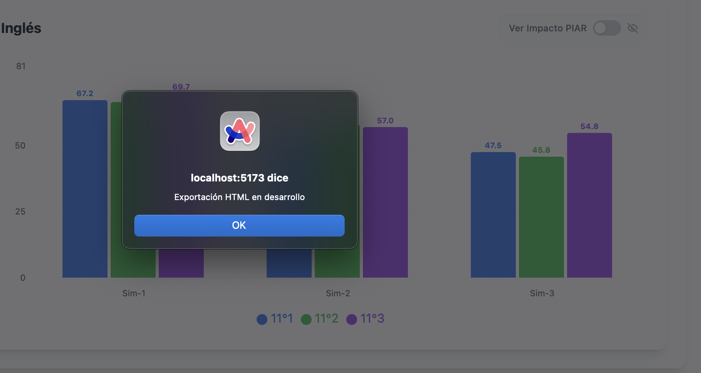

1. 

cuando exporto el html sale ese mensaje y no descarga el html. Por favor corrige.

2. Quiero que en la pestaña "Por Estudiante" haya la posibilidad de ver una tabla con filtros (así como la que aparece en los otros html exportados de los otros análisis diferentes al analisis longitudinal), en la cual por favor se vea el ranking de estudiantes de acuerdo a las diferentes pruebas, o sea con el promedio de cada estudiante en el global, en el de cada asginatura, y demás, o sea los mismos campos y filtros que la tabla grande por ejemplo que aparece en el html exportado en el analisis de una solla cohorte. Y quiero también que a cada estudiante le agregues una columna que diga si el estudiante presento todas las pruebas, si sí o si no.

