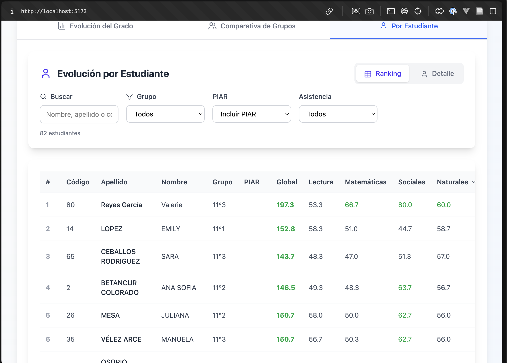

1.

Por favor cambie ese  título a "Ranking promedio" o algo así más diciente.

Te pido tambien que la tabla pueda filtrarse por todos sus campos o columnas, así como se filtra simplemente tocando en el título de de lo columna que se pone la manito y así

2.  El boton exportar informe solo exporta la tabla de la pestaña por estudiante y una que otra cosita. El html exportado debe ser fiel reflejo de todo, con las pestañas y demás. Revisa eso al detalle por favor.

3. Quiero que en la pestaña "Por estudiante" agregues la posibilidad de ver el ranking global por defecto, o sea tal cual como está la tabla, pero también que se puede elegir y ver la misma tabla ranking pero por ejemplo de simulacro 1, o del simulacro 2 y así, pero que la tabla que salga por defecto sea la del último simulacro.