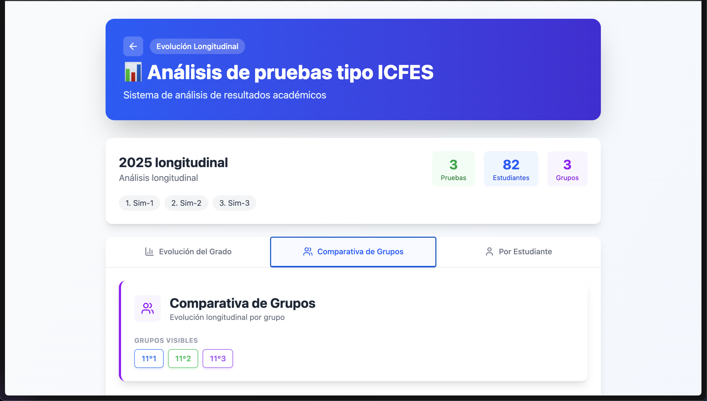
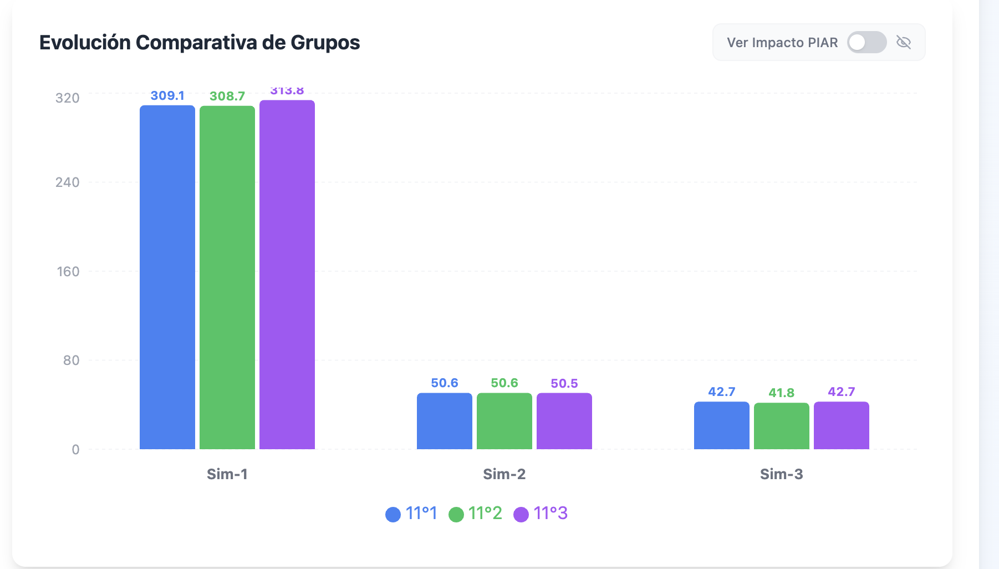
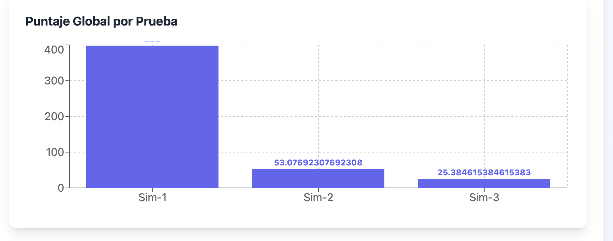
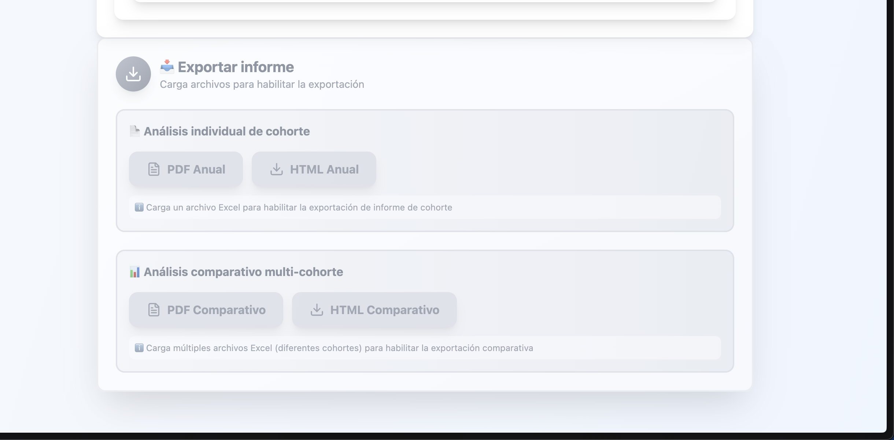

Sigo con algunas anotaciones.

1. El contenedor principal no ocupa el 100% del ancho de la pantalla. 

2. Hay gráficos que cuando son la barra más alta, la etiqueta del valor se ve como cortada arriba. , . CORRIGE ESO PARA TODOS LOS GRÁFICOS EN TODAS LAS PESTAÑAS, INCLUIDA LA PESTAÑA "Por Estudiante". UNA SIOLUCIÓN ROBUSTA Y DE BUENAS PRÁCTICAS, MANTENIBLE.

3. En el pie de de página, quiero que lo cambies por simplemente el botón que diga exportar, tipo algo así, para exportar el informe html. 

4. En la pestaña "Comparativa de grupos" quiero que por favor compares las mismas métricas que comparaste en el informe que están en la pestaña "Evolución del grado". Quitando por ejemplo esa matriz de resultados que se se vuelve redundante, por ejemplo: quiero que por favor en la pestaña "Comparativa de Grupos", muestres las gráficas de la sección "Desglose por Asignatura" de la pestaña "Evolución del Grado", pero ya separado por grupo.

