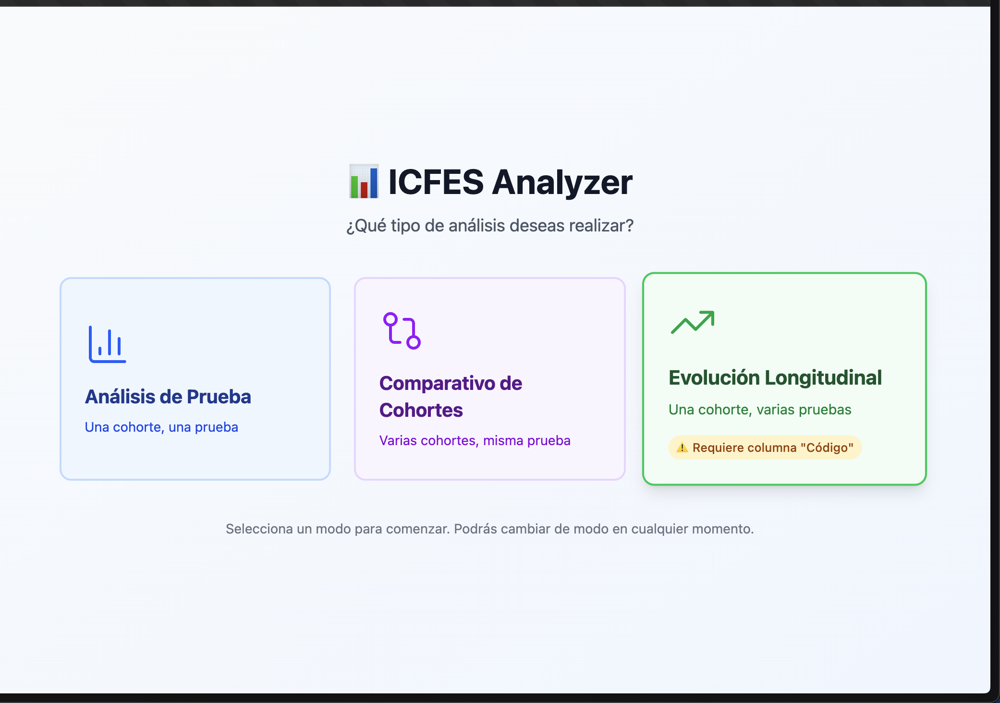
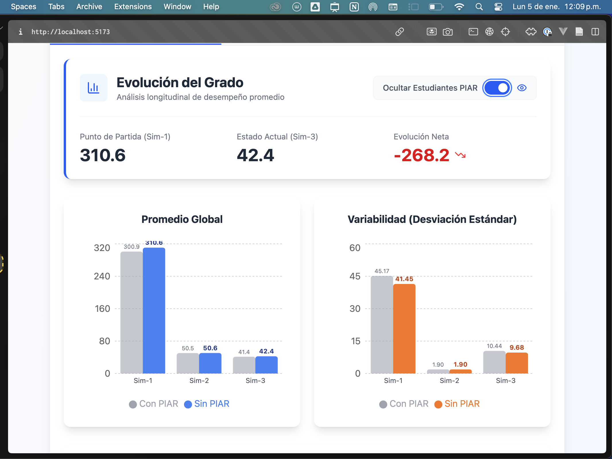
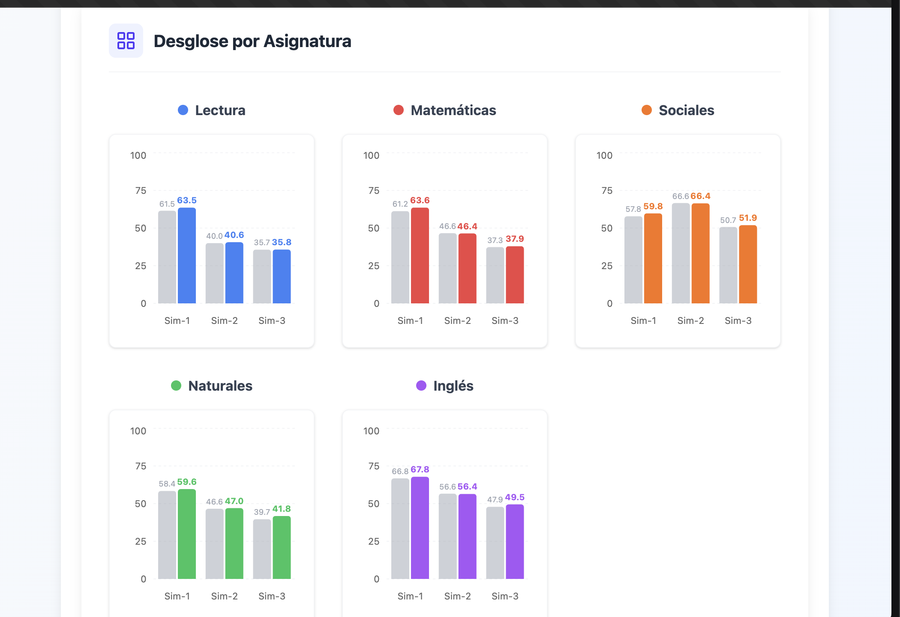
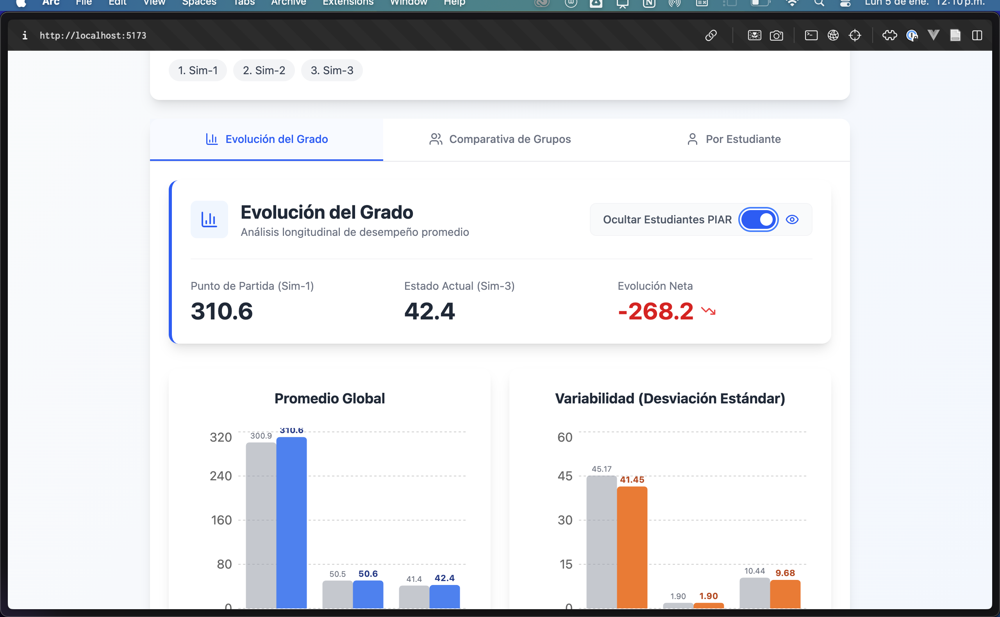

Mejor trabajemos sobre lo que ya está montado. Tengo algunas anotaciones. 

Con respecto al trabajo con las métricas sobre la evolución longitudinal,
,
tengo algunas anotaciones:

1.  
Por favor cada gráfica debe ocupar todo el ancho del contendor, para que se visualice mejor por ejemplo si se van a comparar muchas pruebas a lo largo del año para un solo grupo, no haya problema con el espaciado horizontal. 

2.  El ancho del contenedor que tiene las gráficas, o del contenido en general, debe ocupar todo el ancho de la pantalla, por esa misma razón de que esté preparado para evolución del grado y sus grupos a lo largo de muchas pruebas.

3. El toggle que pones (Ver impacto PIAR), , por favor ponlo a la altura de cada gráfica porque si queda arriba, como que cuando estoy en gráficas de abajo, me tocaría volver arriba para visualizarlo y es incómodo.

Las antoaciones que te acabo de hacer aplican para todas las gráficas de todas las pestañas "Evolución del grado" y "Comparativa de grupos". 

PROCEDE CON LAS MEJORES PRÁCTICAS DE CÓDIGO MANTENIBLE Y ESCALABLE.