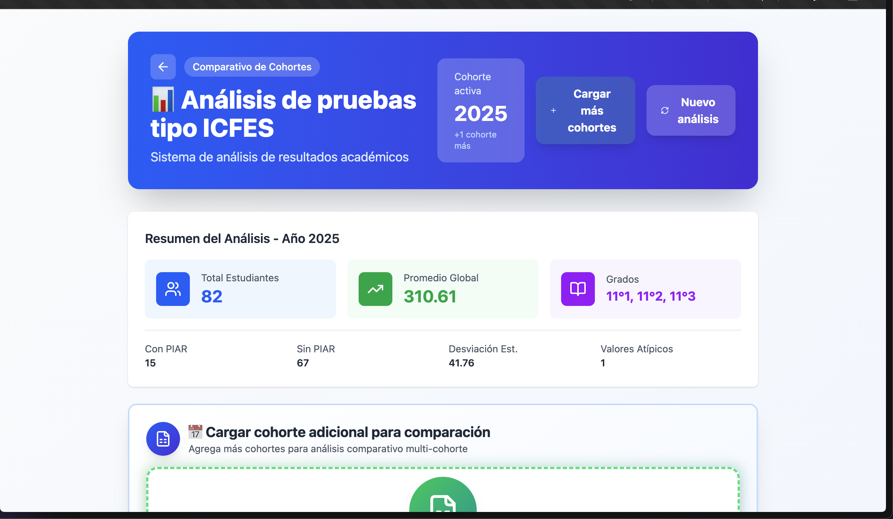

me refiero a que esta interfaz cuando uno entra a la opcion de analizas multicohorte no me gusta. QUIERO QUE TENGA LO NECESARIO Y PARECIDA A LA INTERFAS CUANDO UNO ENTRA A LA OPCIÓN ANALISIS LONGITUDINAL, QUE ES MUCHO MÁS LIMPIA Y FÁCIL DE ENTENDER.

LO MISMO QUEIERO QUE HAGAS Y CORRIJAS CON LA INTERFAZ DEL BOTÓN ANALISIS E UNA SOLA COHORTE.

POR FAVOR ASEGURA CAMBIOS ANTES DE PROCEDER Y LUEGO PROCEDE CON BUENAS PRÁCTICAS.